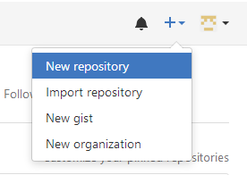
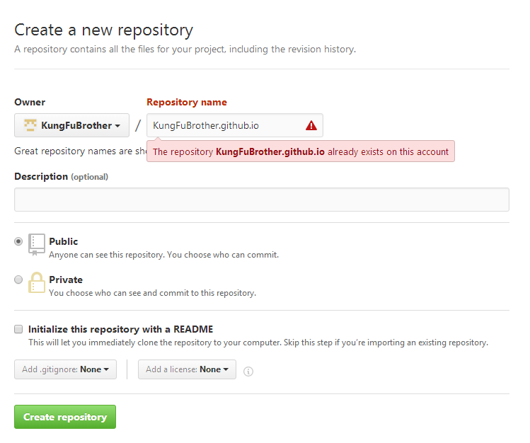
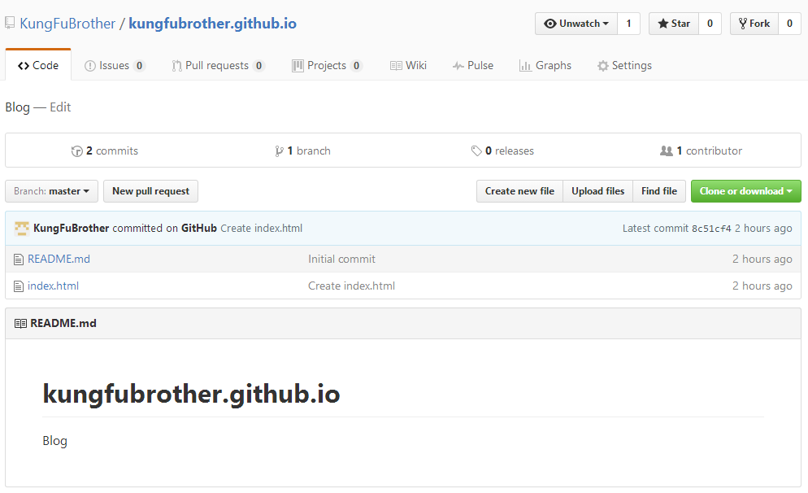
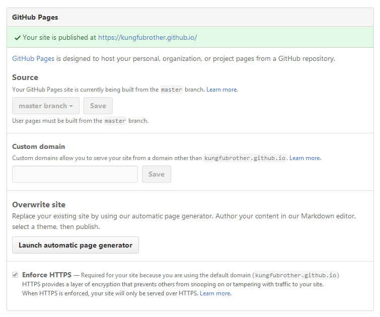

# 搭建GitHub个人主页

#### 1. 首先注册GitHub账号
#### 2. Create New Repository（创建一个新仓库）

> - 在个人主页，点击右上角，新建一个仓库
>  
> - 仓库名称与为`账户名.github.io`，这样才能通过域名`账户名.github.io`访问此仓库主页，由于我已经创建了，所以图中提示仓库已存在
>  

#### 3. 仓库创建成功后就可以通过`账户名.github.io`进行访问了
#### 4. 到第3步基本上就可以结束了，web前端工程师在此仓库中搭建完整的web项目，并push到repository中，就可以立即访问到自己开发的主页了。不过也可以选择GitHub提供的几个主页模板，具体方法如下
> - 点击右上角的Settings
> 
> - Launch automatic page generator
> 
